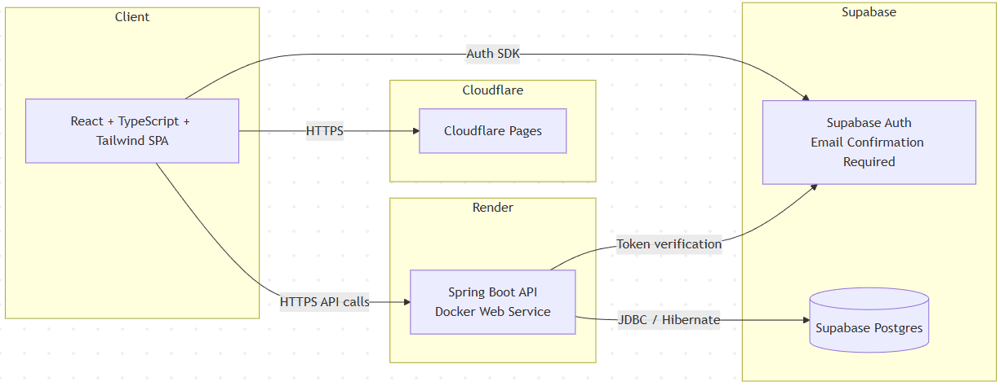

# System Architecture — MVP v1

## Overview
This system is a single-page application (SPA) with a REST backend, plus managed authentication and database services.

## High-Level Architecture
- React SPA hosted on Cloudflare Pages
- Spring Boot REST API hosted on Render **as a Docker container**
- Supabase provides authentication (including mandatory email confirmation) and PostgreSQL database
- Docker is used for **both**:
  - local runtime parity (development)
  - production packaging/runtime (Render)

## Architecture Diagram

## Component Responsibilities

### Frontend
- UI rendering and routing
- User authentication via Supabase SDK
- Handles the email confirmation user journey:
  - after sign-up, show a confirmation-required screen
  - block access to protected app features until confirmation is completed
  - provide a way to re-send the confirmation email (via Supabase)
- Client-side validation (UX-level; not authoritative)
- Sends JWT in `Authorization` header to backend

### Backend (containerized)
- REST API endpoints for tasks/projects
- Token validation (extract Supabase user id from JWT)
- Enforces that the authenticated user is eligible to access the app (email-confirmed requirement)
- Authorization and ownership checks (authoritative)
- Business logic and transactions
- Database access via Hibernate (Supabase Postgres)
- Runs identically as a container:
  - locally (Docker)
  - in production (Render Docker Web Service)

### Database Migrations

The backend manages database schema using **Flyway SQL migrations**.

- Migration files live in `src/main/resources/db/migration/`.
- Migrations are versioned and applied automatically on startup.
- Hibernate DDL auto-generation is disabled (`ddl-auto=validate`); Flyway is the single source of truth for schema creation and evolution.
- The database connection is configured using environment variables (DB host, name, user, password).

### Supabase
- Supabase Auth manages user identity, issues JWTs, and enforces email confirmation requirements
- Supabase Postgres stores application data

### Docker (role in architecture)
Docker is part of the system design for MVP v1:
- The backend is packaged into a container image
- The same packaging format is used for development and production
- Secrets and environment-specific values are injected at runtime via environment variables
- The container image must remain environment-agnostic (no embedded secrets or hard-coded URLs)

## Architectural Style
- Modular monolith backend
- Layered architecture:
  - Controller (HTTP mapping)
  - Service (business rules + authorization)
  - Repository (persistence)
  - Domain (entities/value objects)

## Trust Boundaries
- Browser is untrusted
- Backend is the security enforcement point
- Database is accessed only by backend
- Supabase Auth is trusted for identity issuance; backend must still validate tokens and enforce application eligibility rules