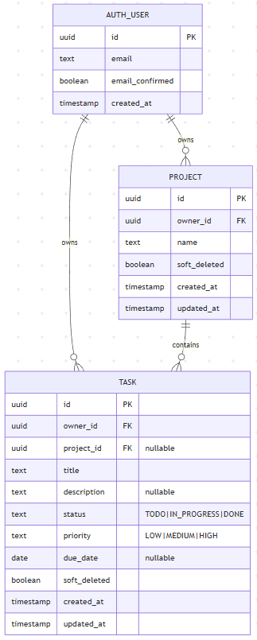

# Data Model — MVP v1

## Identity
User identity is provided by Supabase Auth.
The Supabase user ID (JWT `sub`) is used as `owner_id`.

## Tables (conceptual)

### projects
- id (UUID, PK)
- owner_id (UUID, required)
- name (text, required)
- soft_deleted (boolean, default false)
- created_at (timestamp)
- updated_at (timestamp)

### tasks
- id (UUID, PK)
- owner_id (UUID, required)
- project_id (UUID, nullable FK → projects.id)
- title (text, required)
- description (text, nullable)
- status (TODO | IN_PROGRESS | DONE)
- priority (LOW | MEDIUM | HIGH)
- due_date (date, nullable)
- soft_deleted (boolean, default false)
- created_at (timestamp)
- updated_at (timestamp)

## Indexes (v1)
- tasks(owner_id, status, due_date)
- tasks(owner_id, project_id)
- projects(owner_id)

## Integrity Rules
- Tasks must always have an owner.
- If project_id is present, it must reference a project owned by the same owner (enforced in backend service layer in v1).
- Soft-deleted rows are excluded by default from lists.

## Docker parity
- The schema and constraints must remain identical regardless of where the backend container runs (local Docker vs Render).
- If a local Postgres container is used for development, it should mirror Supabase table structure and migrations.

## Entity Relationship Diagram
